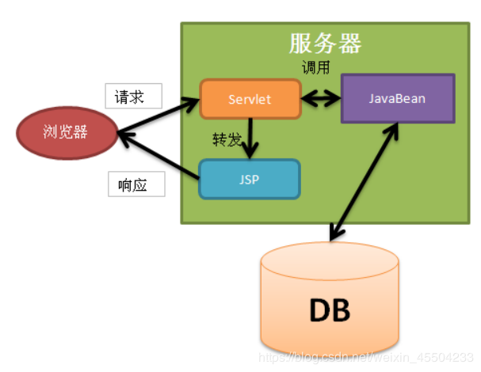
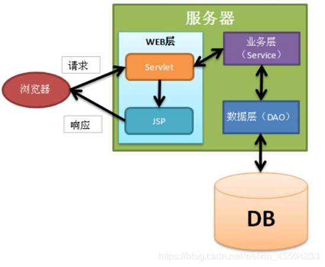

# 第一章-spring初识
## 1. framework(框架)
	框架就是一些类和接口的集合，通过这些类和接口协调来完成一系列的程序实现。JAVA框架可以分为三层：表示层，业务层和物理层。框架又叫做开发中的半成品，它不能提供整个WEB应用程序的所有东西，但是有了框架，我们就可以集中精力进行业务逻辑的开发而不用去关心它的技术实现以及一些辅助的业务逻辑。大家熟知的Structs和Spring就是表示层和业务层框架的强力代表。（说的太官方了）
    人话：
	框架就是某些个人或者组织定义了一系列的类或者接口，提前定义好了一些实现，用户可以在这些类和接口的基础之上，使用这些类来迅速的形成某个领域或者某个行业的解决方案，简化开发的过程，提高开发的效率。就好比：你要盖一座房子，先把柱子，房梁等先建设好，然后只需要向房子中填充就可以了，可以按照自己的需求进行设计，其实我们做的项目、系统都是类似的方式，如果所有的代码全部都需要自己实现，那么这个工程就太庞大了，所以可以先创建出一些基础的模板框架，开发人员只需要按照自己的需求向架子中填充内容，完成自己独特需求即可，这就是框架存在的意义。其实我们之前定义的简单的工具类这些东西也是类似的原理，只不过比较单一简单而已，因此，在现在的很多项目系统开发的过程中都是利用框架进行开发。 
## 2. 架构发展历程
	随着互联网的发展，网站应用的规模不断扩大，常规的垂直应用架构已无法应对，分布式服务架构以及流动计算架构势在必行，亟需一个治理系统确保架构有条不紊的演进。
 

### 单一应用架构
	当网站流量很小时，只需一个应用，将所有功能都部署在一起，以减少部署节点和成本。此时，用于简化增删改查工作量的数据访问框架(ORM)是关键。
### 垂直应用架构
	当访问量逐渐增大，单一应用增加机器带来的加速度越来越小，提升效率的方法之一是将应用拆成互不相干的几个应用，以提升效率。此时，用于加速前端页面开发的Web框架(MVC)是关键。
### 分布式服务架构
	当垂直应用越来越多，应用之间交互不可避免，将核心业务抽取出来，作为独立的服务，逐渐形成稳定的服务中心，使前端应用能更快速的响应多变的市场需求。此时，用于提高业务复用及整合的分布式服务框架(RPC)是关键。
### 流动计算架构
	当服务越来越多，容量的评估，小服务资源的浪费等问题逐渐显现，此时需增加一个调度中心基于访问压力实时管理集群容量，提高集群利用率。此时，用于提高机器利用率的资源调度和治理中心(SOA)是关键。

### Java主流架构技术演变之路
#### 1、Servlet+JSP+JavaBean 
 
#### 2、MVC三层架构
 
#### 3、使用EJB进行应用的开发，但是EJB是重量级框架（在使用的时候，过多的接口和依赖，侵入性强），在使用上比较麻烦
#### 4、Struts1/Struts2+Hibernate+Spring
#### 5、SpringMVC+Mybatis+Spring
#### 6、SpringBoot开发，约定大于配置
## 3. Spring介绍
官网地址：https://spring.io/projects/spring-framework#overview
spring5中文手册：https://github.com/DocsHome/spring-docs/blob/master/SUMMARY.md
压缩包下载地址：https://repo.spring.io/list/libs-snapshot-local/org/springframework/spring/
源码地址：https://github.com/spring-projects/spring-framework

​翻译：
Spring Framework 是一个轻量级的解决方案，可以一站式构建企业级应用。然而，Spring 是模块化的，允许你使用的你需要的部分，而不必把其余带进来。你可以在任何框架之上去使用IOC容器，但你也可以只使用 Hibernate 集成代码 或 JDBC 抽象层。Spring Framework 支持声明式事务管理，通过 RMI 或 Web 服务远程访问你的逻辑，并支持多种选择持久化你的数据。它提供了一个全功能的 MVC 框架，使您能够将 AOP 透明地集成到您的软件。
Spring 的设计是非侵入性的，也就是说你的领域逻辑代码一般对框架本身无依赖性。在你的集成层（如数据访问层），在数据访问技术和 Spring 的库一些依赖将存在。然而，它应该很容易从你的剩余代码中q分离这些依赖。

人话：
Spring是一个轻量级Java开发框架，最早有Rod Johnson创建，目的是为了解决企业级应用开发的业务逻辑层和其他各层的耦合问题。它是一个分层的JavaSE/JavaEE full-stack（一站式）轻量级开源框架，为开发Java应用程序提供全面的基础架构支持。Spring负责基础架构，因此Java开发者可以专注于应用程序的开发。
Spring最根本的使命是解决企业级应用开发的复杂性，即简化Java开发。
Spring可以做很多事情，它为企业级开发提供给了丰富的功能，但是这些功能的底层都依赖于它的两个核心特性，也就是依赖注入（dependency injection，DI）和面向切面编程（aspect-oriented programming，AOP）。

**简略核心解释**
1. spring是一个轻量级的开源框架。
2. spring为了解决企业级应用开发的业务逻辑层和其他各层的耦合问题
3. spring是一个IOC和AOP的容器框架。
				IOC：控制反转
				AOP：面向切面编程
				容器：包含并管理应用对象的生命周期
**使用spring的优点**
1. Spring通过DI、AOP和消除样板式代码来简化企业级Java开发
2. Spring框架之外还存在一个构建在核心框架之上的庞大生态圈，它将Spring扩展到不同的领域，如Web服务、REST、移动开发以及NoSQL
3. 低侵入式设计，代码的污染极低
4. 独立于各种应用服务器，基于Spring框架的应用，可以真正实现Write Once,Run Anywhere的承诺
5. Spring的IoC容器降低了业务对象替换的复杂性，提高了组件之间的解耦
6. Spring的AOP支持允许将一些通用任务如安全、事务、日志等进行集中式处理，从而提供了更好的复用
7. Spring的ORM和DAO提供了与第三方持久层框架的的良好整合，并简化了底层的数据库访问
8. Spring的高度开放性，并不强制应用完全依赖于Spring，开发者可自由选用Spring框架的部分或全部
9. 任何一个语言或者任何一个框架想要立于不败之地，那么很重要的就是它的生态。
 
**spring的模块划分图**
 
**模块解释：**
Test:Spring的单元测试模块
Core Container:核心容器模块
AOP+Aspects:面向切面编程模块
Instrumentation:提供了class instrumentation支持和类加载器的实现来在特定的应用服务器上使用,几乎不用
Messaging:包括一系列的用来映射消息到方法的注解,几乎不用
Data Access/Integration:数据的获取/整合模块，包括了JDBC,ORM,OXM,JMS和事务模块
Web:提供面向web整合特性
## 3. IOC（Inversion of Control）:控制反转
基本概念
IoC is also known as dependency injection (DI). It is a process whereby objects define their dependencies (that is, the other objects they work with) only through constructor arguments, arguments to a factory method, or properties that are set on the object instance after it is constructed or returned from a factory method. The container then injects those dependencies when it creates the bean. This process is fundamentally the inverse (hence the name, Inversion of Control) of the bean itself controlling the instantiation or location of its dependencies by using direct construction of classes or a mechanism such as the Service Locator pattern.
IOC与大家熟知的依赖注入同理，. 这是一个通过依赖注入对象的过程 也就是说，它们所使用的对象，是通过构造函数参数，工厂方法的参数或这是从工厂方法的构造函数或返回值的对象实例设置的属性，然后容器在创建bean时注入这些需要的依赖。 这个过程相对普通创建对象的过程是反向的（因此称之为IoC），bean本身通过直接构造类来控制依赖关系的实例化或位置，或提供诸如服务定位器模式之类的机制。
 
人话：

IOC是一种设计思想，在Java开发中，将你设计好的对象交给容器控制，而不是显示地用代码进行对象的创建。  

把创建和查找依赖对象的控制权交给 IoC 容器，由 IoC 容器进行注入、组合对象之间的关系。这样对象与对象之间是松耦合、功能可复用（减少对象的创建和内存消耗），使得程序的整个体系结构可维护性、灵活性、扩展性变高。  所谓IOC ，就简短一句话：对象由spring来创建、管理，装配！    

 

为什么使用IOC:
看代码
思考

你可以想象一下，假如当年设计鼠标键盘的人直接焊在电脑主板芯片上，没有鼠标就主板就废了启动不了，鼠标出现问题导致主板出现问题，外设坏了想换要拆开重新焊一个上去，这样的扩展性，可维护性 多差！ 所以设计者提供一个接口出来可以接受不同的外设？并且让外设变成可插拔？

每次鼠标坏了需要拆开电脑，重新焊一个鼠标上去。导致代码的变更巨大，任何的变更都会加大造成系统BUG的可能性。
UserDaoImpl dao=new  UserDaoImpl();

接口分离原则ISP(the Interface Segregation Principle ISP)
	模块间要通过抽象接口隔离开，而不是通过具体的类强耦合起来
    不要将鼠标（具体实现）直接焊在主板上，使用插口（抽象）连接；

现在接口有了，但是无法热插拔。 每次鼠标坏了需要关掉电脑才能更换（实现类换了还是需要去变更代码）
IUserDao dao=new  UserDaoImpl();

依赖倒置原则DIP(the Dependency Inversion Principle DIP) 
	具体实现依赖抽象，下层依赖上层。    分离
 依赖倒置原则使鼠标、键盘和电脑成为独立的的互不相干的对象，当电脑（上层）没有鼠标可以正常启动但是鼠标（下层）没有电脑则一无是处 ，控制权就被反转了（IOC）。 所以鼠标需要依赖USB（DI）才能使用。
	之前——正转: 主板---焊接--->鼠标    电脑没有鼠标则无法启动          
        现在——反转: 电脑<---依赖---鼠标     引入DI可以实现IOC

 IOC是DIP的设计原理，DI是IOC的具体实现

鼠标坏了很快就可以换一个，虽然会涉及短暂无法使用， 但是产生的变更极少。

IUserDao dao=从ioc种获取     涉及到的代码变更极少。

4.IOC代码实现
最low的实现方式：导入jar包---配置xml    入门  搭建基于ioc的spring
1. 导入jar包
  访问：spring仓库https://repo.spring.io/list/libs-snapshot-local/org/springframework/spring/   下载任意版本的spring
只需要下载dist.zip    -  包含了docs    schema

配置xml
<?xml version="1.0" encoding="UTF-8"?>
<beans xmlns="http://www.springframework.org/schema/beans"
       xmlns:xsi="http://www.w3.org/2001/XMLSchema-instance"
       xsi:schemaLocation="http://www.springframework.org/schema/beans http://www.springframework.org/schema/beans/spring-beans.xsd">

    <bean class="cn.tulingxueyuan.dao.UserDao" id="userDao"></bean>

    <bean class="cn.tulingxueyuan.service.UserService" id="userService">
        <property name="dao" ref="userDao"></property>
    </bean>
</beans>

一般实现方式：maven+注解+xml           
需要导入jar    配置maven依赖 
去pom.xml
<?xml version="1.0" encoding="UTF-8"?>
<project xmlns="http://maven.apache.org/POM/4.0.0"
         xmlns:xsi="http://www.w3.org/2001/XMLSchema-instance"
         xsi:schemaLocation="http://maven.apache.org/POM/4.0.0 http://maven.apache.org/xsd/maven-4.0.0.xsd">
    <modelVersion>4.0.0</modelVersion>

    <groupId>cn.tulingxueyuan.spring</groupId>
    <artifactId>spring_ioc</artifactId>
    <version>1.0-SNAPSHOT</version>

    <dependencies>
        <dependency>
            <groupId>org.springframework</groupId>
            <artifactId>spring-context</artifactId>
            <version>5.2.6.RELEASE</version>
        </dependency>
    </dependencies>

</project>

添加spring配置文件：
<?xml version="1.0" encoding="UTF-8"?>
<beans xmlns="http://www.springframework.org/schema/beans"
       xmlns:xsi="http://www.w3.org/2001/XMLSchema-instance"
       xsi:schemaLocation="http://www.springframework.org/schema/beans http://www.springframework.org/schema/beans/spring-beans.xsd">

    <bean class="cn.tulingxueyuan.beans.User" id="user"></bean>
</beans>

编写测试类：

public class IocTest {

    @Test
    public void test01(){
        ApplicationContext ioc=new ClassPathXmlApplicationContext("spring-ioc.xml");
        User bean = ioc.getBean(User.class);
        System.out.println(bean);

    }
}

最屌实现方式：springboot+javaconfig   
 
 
 
5、总结
DI与IOC
很多人把IOC和DI说成一个东西，笼统来说的话是没有问题的，但是本质上还是有所区别的,希望大家能够严谨一点，IOC和DI是从不同的角度描述的同一件事，IOC是从容器的角度描述，而DI是从应用程序的角度来描述，也可以这样说，IOC是依赖倒置原则的设计思想，而DI是具体的实现方式

在面向对象设计的软件系统中，底层的实现都是由N个对象组成的，所有的对象通过彼此的合作，最终实现系统的业务逻辑。

有一个对象出了问题，就可能会影响到整个流程的正常运转。现在，伴随着工业级应用的规模越来越庞大，对象之间的依赖关系也越来越复杂，经常会出现对象之间的多重依赖性关系，因此，架构师和设计师对于系统的分析和设计，将面临更大的挑战。对象之间耦合度过高的系统，必然会出现牵一发而动全身的情形。

大家看到了吧，由于引进了中间位置的“第三方”，也就是IOC容器，对象和对象之间没有了耦合关系， 它起到了一种类似“粘合剂”的作用，把系统中的所有对象粘合在一起发挥作用，如果没有这个“粘合剂”，对象与对象之间会彼此失去联系，这就是有人把IOC容器比喻成“粘合剂”的由来。

通过前后的对比，我们不难看出来：对象A获得依赖对象B的过程,由主动行为变为了被动行为，控制权颠倒过来了，这就是“控制反转”这个名称的由来。

ioc优点
解耦

集中管理
功能可复用（减少对象的创建和内存消耗）
使得程序的整个体系结构可维护性、灵活性、扩展性变高
解耦

作业：
介绍一下你对spring的认识
控制反转(IoC)有什么作用？
IOC的优点是什么？
搭建Spring-IoC框架